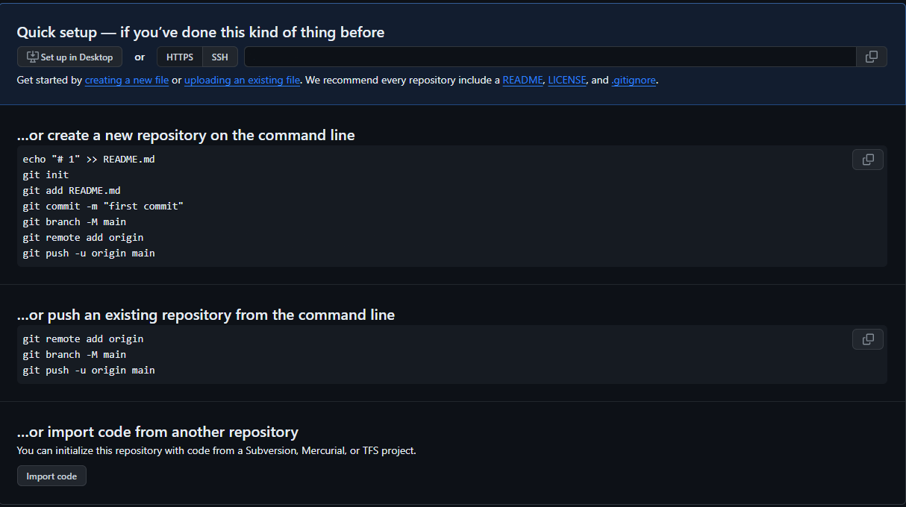

## Что такое удаленный репозиторий?


Удаленный репозиторий - это репозиторий, хранящийся в облаке, на стороннем сервисе, специально созданном для работы с git имеет ряд преимуществ. Во-первых - это своего рода резервная копия вашего проекта, предоставляющая возможность безболезненной работы в команде. А еще в таком репозитории можно пользоваться дополнительными возможностями хостинга. К примеру -визуализацией истории или возможностью разрабатывать вашу программу непосредственно в веб-интерфейсе.


Для создания удаленного репозитория вам необходимо открыть терминал, и ввести в него данные команды:

```
git init (создание репозитория);

git add . (добавление всех фалов в репозиторий);

git commit -m "first commit" (добавление коммита);

git branch -M main (Добавление ветки);

git remote add origin (позволяет подключиться к удаленному репозиторию);

git push -u origin main (позволяет передать изменения репозитория в удаленный репозиторий).
```
При создании репозитория на GIT все эти комманды буду перечисленны.




---
Если вам не понравился один из ваших локальных Git-репозиториев и вы хотите стереть его со своей машины. Для этого вам всего лишь надо удалить скрытую папку «.git» в корневом каталоге репозитория. Сделать это можно 3 способами:

Проще всего вручную удалить эту папку «.git» в корневом каталоге «Git Local Warehouse».

Также удалить, не устраивающий вас, репозиторий можно на github. Открываете нужный вам объект и переходите в пункт меню Настройки. Там, прокрутив ползунок вниз, вы попадете в зону опасности, где один из пунктов будет называться «удаление этого хранилища».

Последний метод удаления локального хранилища через командную строку, для этого в терминале необходимо ввести следующую команду:
```
cd repository-path/
rm -r .git
```